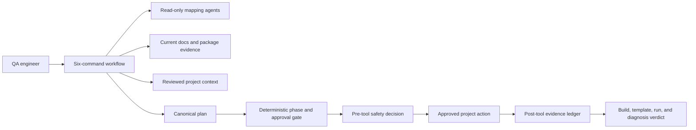
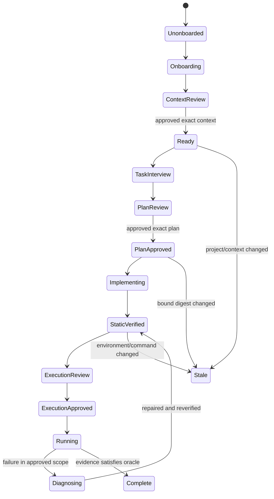

# Architecture

## Product boundary

The plugin is a Claude Code marketplace package named `qaas`. It contributes
six manual lifecycle skills, hidden domain skills, bounded read-only subagents,
project-context templates, and deterministic Node.js hooks. It operates inside
an existing QaaS test repository and does not contain or modify the QaaS
framework.

The architecture separates language-model judgment from local authority:

The model may propose, explain, map, and implement. It may not create its own
approval, change phase state directly, read the signing key, broaden a tool
authorization, or direct a deletion.

## Skill layers

The visible commands are thin wrappers:

- `onboard`
- `plan`
- `implement`
- `run`
- `diagnose`
- `doctor`

Each invokes the hidden `qaas-workflow` contract with one fixed phase. Hidden
skills provide project mapping, documentation lookup, YAML/C# authoring, hook
authoring, sample work, module resolution, upgrades, verification, README
writing, and minimal-change review. They do not add menu commands because their
frontmatter sets `user-invocable: false`.

Every domain skill delegates lifecycle selection, authoritative state,
readiness, reviews, and approvals to `qaas-workflow`. It can return only bounded
findings or proposed actions. A model-derived classification is tentative until
corroborated and cannot itself authorize a transition.

This split keeps each prompt small enough for the target context window and
loads detailed references only when needed. It also makes the state engine,
rather than natural-language routing, the final judge of a legal transition.

## State machine

The normal lifecycle is:

Illegal transitions fail closed. A relevant fingerprint change marks the
dependent phase `STALE`; it never silently carries an old approval forward.

## Durable project context

Approved project facts live in `.claude/qaas/`. `context-index.json` names each
topic, digest, source, status, and applicable tasks. `.claude/CLAUDE.md` is a
short router that points sessions to the workflow and relevant topics.

Task state records what is done, what remains, evidence, rationale, repairs, and
the final verdict. It records decisions and alternatives, not hidden
chain-of-thought. Before the context-write gate, resumable onboarding state is
kept in a protected plugin-data staging record rather than the project.

Subagents receive a bounded question, path/source scope, and output contract.
They are read-only unless the top-level coordinator gives them an inherited
one-use authorization. They cannot mint approvals or broaden scope. Their
findings are evidence to be reconciled by the coordinator, not authority.

## Local authority

The authoritative record is under
`${CLAUDE_PLUGIN_DATA}/projects/<project-id>/`, separate from the committed
project mirror. It contains:

- A per-install HMAC key.
- Canonical project identity and nonce.
- Plugin/state format versions.
- Current context and phase fingerprints.
- A signed hash-chained event head.
- Pending and consumed one-use tool authorizations.
- The single-writer lease.

JSON is canonicalized before hashing/signing. Writes use same-directory
temporary files and atomic replacement. Lock/lease checks and expected prior
digests provide compare-and-swap behavior. A crash between tool execution and
the post-tool ledger makes the task stale.

The model receives redacted decisions and identifiers, never the key. The
pre-tool hook denies model-mediated access to authority/key paths through file,
shell, PowerShell, and MCP surfaces.

## Fingerprints

Four related digests narrow invalidation:

1. `projectFingerprint`: relevant project inputs and mapped external artifacts.
2. `contextFingerprint`: approved topic files and readiness.
3. `planFingerprint`: task plan, package snapshot, and intended diff envelope.
4. `staticVerificationFingerprint`: final project, dependency/build evidence,
   and rendered QaaS template bound to execution.

Fingerprints normalize paths cross-platform and hash file content. Generated
outputs count only when their output class and producing tool were enumerated
in the plan.

## Documentation and integrations

The docs resolver prefers an approved read-only MCP documentation source or
administrator-provisioned local ZIM, then the immutable distribution-built
documentation endpoint. There is no per-project or runtime docs URL. It records
source identity, page, artifact/commit digest when available, excerpt digest,
applicable package snapshot, and compatibility decision.

External repository and artifact reads use capability descriptors rather than
assuming a tool exists. Existing local content is preferred. A user-supplied
GitLab, modules, or Common Hooks URL is reachable only through a signed,
task/session-bound, one-use GET review with bounded redacted output. If
repository semantics are required during discovery, a separate signed one-use
transaction may create an immutable protected bare checkout for the exact
reviewed modules, Common Hooks, or reference-project source. Only bounded
inventory and single-file reads can expose its content.

No changing QaaS fact belongs in the stable workflow prompt. A fact that cannot
be proven from current documentation and installed/available packages is an
unknown, not a generated answer.

The observability query surface is hidden rather than a seventh lifecycle
command. A query plan binds the exact execution digest, current fingerprint,
capability ID, tool and bounded input, exact non-secret endpoint or local selector,
credential-variable names, limits, purpose, typed response checks, and
canonical digests. Authority consumes its approval once. An absent, stale,
opaque, or unproven read-only connector blocks access instead of permitting a
direct MCP, browser, CLI, shell, Kubernetes, or database fallback.

The capability tool/input is only the reviewed permission contract. Execution
uses fixed internal `qaas-internal-project-artifact-v1` (Allure) or
`qaas-internal-http-get-v1` (remote GET) adapters, never the registered tool
directly. The review binds a sanitized endpoint identity and endpoint-value
digest; the adapter rechecks them immediately before reading.

## Action enforcement

The pre-tool handler classifies:

- Read-only project and approved-source access.
- A one-use reference checkout covered by its exact signed source approval.
- Writes covered by a signed context or implementation transaction.
- Tool-owned generated outputs covered by the plan.
- Test execution covered by an execution plan.
- A separate one-use read-only observability query covered by its own canonical
  query plan, current proven capability, review, and approval. Execution plans
  always keep `observabilityQueries` empty.
- Non-deleting infrastructure mutation covered by a mutation plan.
- Always-denied deletion/move/rename/cleanup and authority access.

Shell and MCP inputs are parsed conservatively. Variable expansion,
subcommands, redirection, pipelines, aliases, opaque scripts, or an unknown MCP
schema cannot be treated as harmless without a matching exact authorization.

After an allowed action, the post-tool handler records the resolved invocation,
exit code, output/evidence hashes, redacted excerpt, resulting fingerprints,
and authorization consumption. One authorization cannot be replayed.

## Compatibility

The public scripts use only Node.js built-ins. Skill frontmatter avoids a
redundant `name` field for Claude Code >=2.1.180 namespace compatibility. The
plugin does not rely on later agent-team APIs. Windows paths and PowerShell are
first-class; path canonicalization and CI also cover Linux.

Claude hooks are not an OS sandbox. The security promise applies while the
installed plugin and attested hooks are active and the local user has not
tampered with their authority storage.
